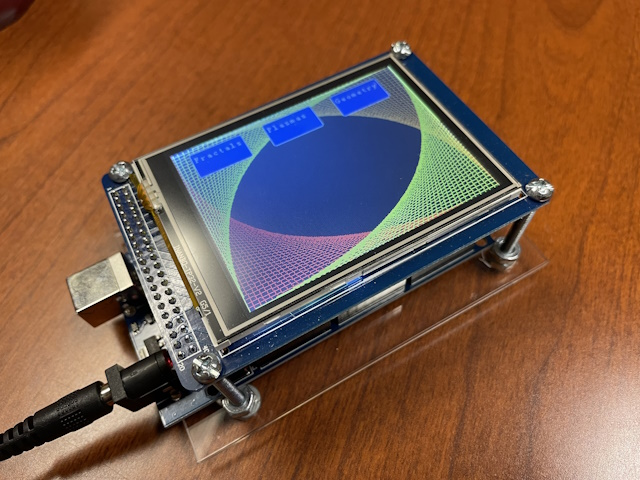
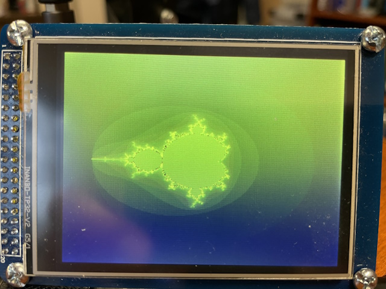
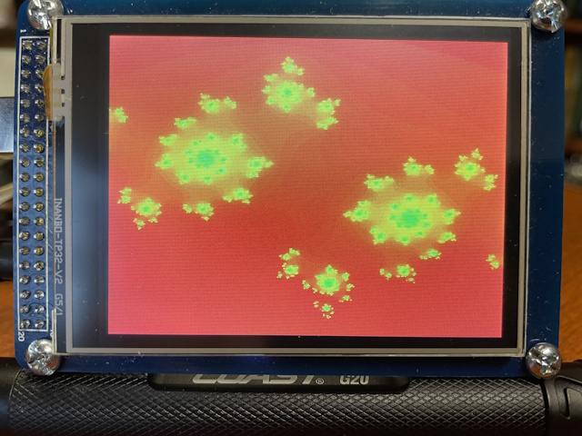
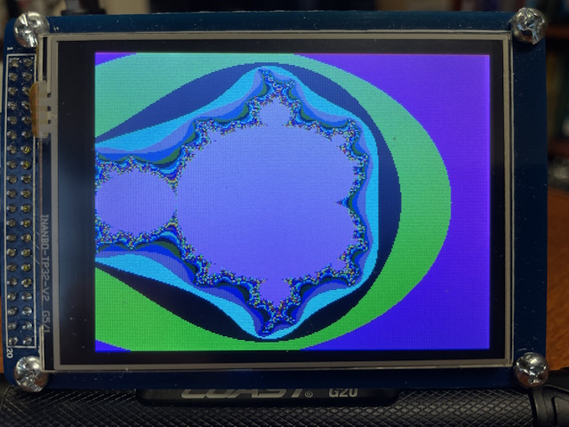
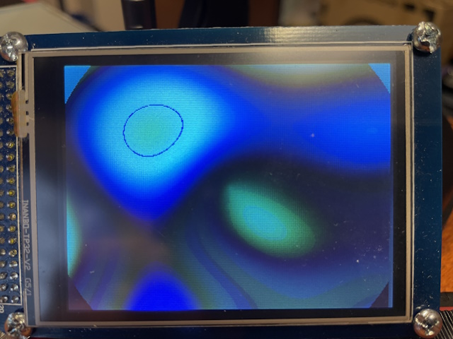
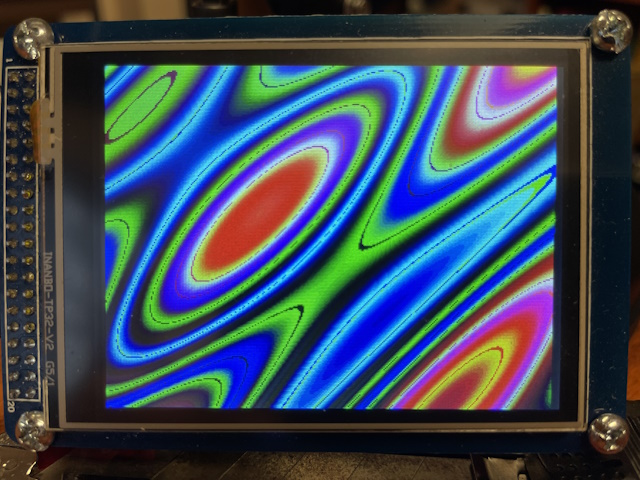
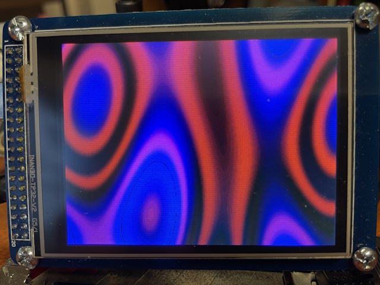

# Desktop Contemplator V2.0

## Description

This is an Arduino project using an Arduino Mega board to show on a
TFT display several different visual effects. You can select via 
three TFT buttons one of three different types of patterns to 
render for your enjoyment: 1) fractals, 2) plasmas, or 3) cool geometry.

## Hardware

If you wanted to replicate this project, these are the main components.

--Mega 2560 R3 + Adaptor Shield + 3.2 TFT LCD Touch Panel

https://www.sainsmart.com/products/mega2560-r3-adaptor-shield-3-2-tft-lcd-touch-panel

If you cannot find the exact HW, you should be able to portion 
this code to any Arduino MEga and TFT Display.

## Software

--Arduiono IDE

--Libraries needed:

(1) UTFT Library: http://www.rinkydinkelectronics.com/library.php?id=51#google_vignette

## Video description

https://www.youtube.com/watch?v=3CzaQVlBt2g 

## Credits

This code is an adaptation of the project "Desktop Contemplator for Nuts 
and Volts", which was developed by Craig A. Lindley for SainSmart 3.2" 
TFT LCD Display. MOre details can be found here:

https://www.nutsvolts.com/magazine/article/december2012_Lindley

## More Photos

